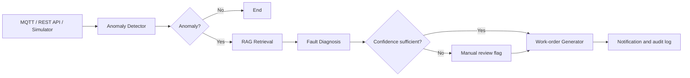

# Industrial Inspection Agent

[](https://github.com/AikingChoice/industrial-inspection-agent/actions/workflows/ci.yml)

面向工业设备巡检场景的 AI Agent：接收 MQTT、REST API 或模拟器产生的传感器数据，通过 LangGraph 编排异常检测、RAG 故障诊断和维修工单生成，将人工排查流程转化为可追踪、可降级的自动化工作流。

> A production-minded industrial inspection agent with explicit LangGraph routing, deterministic sensor validation, RAG-assisted diagnosis, graceful LLM fallback, and automated work-order generation.

## 解决的问题

传统巡检依赖人工查看传感器读数、检索维修手册并创建工单。本项目把流程拆分为边界清晰的 Agent 节点，并针对工业场景补充确定性规则、失败降级和人工复核机制。

| 工程问题 | 实现方式 |
| --- | --- |
| 正常数据无需调用大模型 | LangGraph 条件路由直接结束流程，降低延迟和调用成本 |
| 故障知识分散在案例和文档中 | ChromaDB 向量检索，支持 PDF、DOCX、TXT、Markdown 入库 |
| 外部模型或向量服务可能不可用 | 向量检索降级为关键词检索，LLM 失败降级为 RAG 结果 |
| 传感器可能上报非法或非有限数值 | 在进入诊断前标记无效读数，避免异常数据破坏工作流 |
| 自动诊断存在不确定性 | 置信度低于阈值时标记人工复核 |
| 诊断结果难以进入后续流程 | 自动生成带优先级、维修建议和指派信息的结构化工单 |

## 工作流



LangGraph 中共享的 `InspectionState` 只保存流程必需的数据：传感器输入、异常结果、诊断结果、工单和通知状态。每个节点只读取所需字段并返回状态增量，便于测试、替换和扩展。

## 核心能力

- **Agent 编排**：使用 LangGraph `StateGraph` 组织节点、条件边和共享上下文。
- **RAG 诊断**：检索历史故障案例与上传的设备文档，再交由 LLM 输出结构化诊断。
- **工具接入**：支持 MQTT 实时数据、FastAPI 接口、文档解析和 ChromaDB 持久化。
- **可靠性设计**：规则前置、检索降级、模型调用降级、置信度阈值和人工复核。
- **结构化输出**：统一返回故障类型、严重度、原因、维修建议、匹配案例和工单信息。
- **自动化测试**：29 项测试覆盖异常检测、非法读数、模型降级、RAG 检索、工单生成、文档分块与知识库写入。

## 技术栈

`Python` · `LangGraph` · `LangChain` · `ChromaDB` · `FastAPI` · `MQTT` · `Pytest`

## 快速开始

### 1. 安装依赖

```bash
python -m venv .venv
source .venv/bin/activate  # Windows: .venv\Scripts\activate
pip install -r requirements.txt
```

### 2. 配置模型

```bash
cp .env.example .env
```

编辑 `.env`，填写任意 OpenAI 兼容接口：

```env
LLM_BASE_URL=https://api.deepseek.com
LLM_API_KEY=your-api-key
LLM_MODEL=deepseek-chat
```

### 3. 运行

```bash
# 模拟传感器数据并运行完整工作流
python main.py demo

# 启动 REST API，文档地址为 http://127.0.0.1:8000/docs
uvicorn api:app --reload

# 连接 MQTT Broker
python main.py mqtt
```

提交单条巡检数据：

```bash
curl -X POST http://127.0.0.1:8000/inspect \
  -H "Content-Type: application/json" \
  -d '{
    "device_id": "CNC-Machine-01",
    "sensors": {
      "temperature": 95,
      "vibration": 15.2,
      "pressure": 2.1,
      "rpm": 2200
    }
  }'
```

### 4. 测试

```bash
pytest -q
```

当前结果：`29 passed`。GitHub Actions 会在每次提交和 Pull Request 时自动执行测试。

## API

| Method | Endpoint | Description |
| --- | --- | --- |
| `GET` | `/health` | 服务健康检查 |
| `POST` | `/inspect` | 提交一条传感器数据并运行工作流 |
| `POST` | `/inspect/simulate` | 生成一条模拟数据并巡检 |
| `POST` | `/inspect/batch` | 批量模拟巡检 |
| `POST` | `/knowledge/upload` | 解析设备文档并写入知识库 |
| `GET` | `/knowledge/stats` | 查询知识库统计信息 |

## 项目结构

```text
industrial-inspection-agent/
├── agents/                 # 异常检测、故障诊断、工单生成
├── graph/workflow.py       # LangGraph 状态与条件路由
├── rag/                    # 文档解析、关键词/向量检索
├── mqtt/                   # 数据模拟器与 MQTT 订阅
├── tests/                  # 核心流程和知识库测试
├── api.py                  # FastAPI 服务
├── config.py               # 阈值、模型和存储配置
└── main.py                 # Demo、MQTT、单文件入口
```

## 设计取舍

1. **规则检测先于 LLM**：传感器阈值是确定性约束，不应交给模型猜测；只有异常数据进入诊断节点。
2. **状态图代替隐式 Agent 循环**：流程、上下文和分支在代码中可见，更容易调试和测试。
3. **自动化不等于取消人工**：低置信度结果明确进入人工复核，避免把模型输出直接当作维修结论。
4. **统一节点输入输出**：Agent 通过共享状态协作，外部服务故障不会破坏工单的数据契约。

## 后续计划

- 增加基于设备与会话的持久化上下文，支持跨巡检追踪。
- 为外部工具调用加入超时、重试和熔断策略。
- 建立诊断准确率、召回率、响应时间和降级率评测集。
- 接入真实工单系统与告警渠道，验证端到端闭环。

> 本项目用于展示工业 AI Agent 的工作流设计与工程实现。实际生产部署还需接入设备权限控制、消息重放、监控告警和经过领域专家验证的故障知识库。
