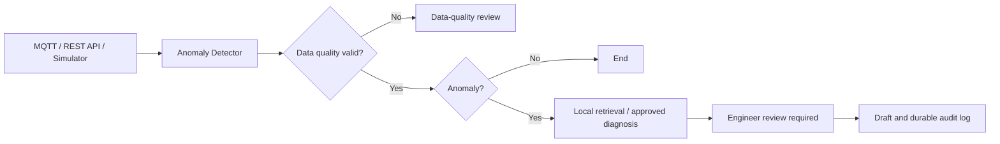

# Industrial Inspection Agent

[](https://github.com/AikingChoice/industrial-inspection-agent/actions/workflows/ci.yml)

面向工业巡检试点的只读维护辅助工具：接收经校验的传感器快照，执行阈值检测、检索故障案例，并生成必须由工程师审核的工单草稿。模拟器和直连 MQTT 仅用于开发环境。

> A read-only maintenance assistant with explicit workflows, validated telemetry, evidence-linked diagnosis, and human-reviewed work-order drafts.

## 解决的问题

传统巡检依赖人工查看传感器读数、检索维修手册并创建工单。本项目把流程拆分为边界清晰的 Agent 节点，并针对工业场景补充确定性规则、失败降级和人工复核机制。

| 工程问题 | 实现方式 |
| --- | --- |
| 正常数据无需调用大模型 | LangGraph 条件路由直接结束流程，降低延迟和调用成本 |
| 故障知识分散在案例和文档中 | 开发环境可用 ChromaDB；受控环境使用离线关键词检索，禁止运行时上传知识文档 |
| 外部模型或向量服务可能不可用 | 开发环境支持降级；生产默认不调用外部 LLM 或向量服务 |
| 传感器可能上报非法或非有限数值 | 在进入诊断前标记无效读数，避免异常数据破坏工作流 |
| 自动诊断存在不确定性 | 所有试点诊断均要求工程师复核；置信度未用现场样本校准 |
| 诊断结果难以进入后续流程 | 生成带优先级和维修建议的结构化工单草稿，人工审核后再流转 |

## 工作流



LangGraph 中共享的 `InspectionState` 保存传感器输入、数据质量结果、异常结果、候选诊断和工单草稿。系统不会将诊断直接转成控制动作或已发送通知。

## 核心能力

- **Agent 编排**：使用 LangGraph `StateGraph` 组织节点、条件边和共享上下文。
- **候选诊断**：检索带版本的故障案例；生产模式默认不启用 LLM 或向量检索。
- **数据接入**：开发环境支持模拟器/MQTT；受控模式只开放带设备白名单的 REST 遥测接口。
- **可靠性设计**：校验测点、单位、工况和事件 ID；异常数据阻止后续诊断。
- **结构化输出**：统一返回故障类型、严重度、原因、维修建议、匹配案例和工单信息。
- **自动化测试**：仓库包含异常检测、模型降级、RAG 检索和工单生成等测试；本次生产硬化改动尚未重新执行测试，不能将既有测试结果视为当前版本的验证结论。

## 技术栈

`Python` · `LangGraph` · `LangChain` · `ChromaDB` · `FastAPI` · `MQTT` · `Pytest`

## 快速开始

### 1. 安装依赖

```bash
python -m venv .venv
source .venv/bin/activate  # Windows: .venv\Scripts\activate
pip install -r requirements.txt
```

### 2. 配置模型

```bash
cp .env.example .env
```

编辑 `.env`，填写任意 OpenAI 兼容接口：

```env
LLM_BASE_URL=https://api.deepseek.com
LLM_API_KEY=your-api-key
LLM_MODEL=deepseek-chat
```

### 3. 运行

```bash
# 模拟传感器数据并运行完整工作流
python main.py demo

# 启动 REST API，文档地址为 http://127.0.0.1:8000/docs
uvicorn api:app --reload

# 连接 MQTT Broker
python main.py mqtt
```

开发环境下提交单条巡检数据：

```bash
curl -X POST http://127.0.0.1:8000/inspect \
  -H "Content-Type: application/json" \
  -d '{
    "device_id": "CNC-Machine-01",
    "sensors": {
      "temperature": 95,
      "vibration": 15.2,
      "pressure": 2.1,
      "rpm": 2200
    }
  }'
```

受控环境请求必须额外携带 `X-API-Key`、稳定唯一的 `X-Event-ID`，并提供与 `sensors` 完全对应的 `sensor_units`、带时区的 `timestamp` 和现场配置的 `operating_state`。上面的模拟设备和数值只用于开发演示，不能复制为现场白名单或阈值。

### 4. 测试

```bash
pytest -q
```

GitHub Actions 会在每次提交和 Pull Request 时执行测试。部署前必须在 CI 和目标环境完成验证；本次改动没有运行测试。

## API

受保护的巡检与知识库接口使用 `X-API-Key` 请求头。开发环境未设置 `API_AUTH_TOKEN` 时允许本地免密运行；生产环境必须配置至少 32 个字符的随机值，否则服务拒绝启动。生产模式同时关闭 `/docs`、`/redoc` 和 OpenAPI 文档端点。知识库上传默认限制为 10 MiB，可通过 `MAX_UPLOAD_BYTES` 调整。API Key 是应用层的基础校验，生产部署仍应通过工厂批准的网关、网络访问控制和 TLS 身份认证进行隔离保护。

| Method | Endpoint | Description |
| --- | --- | --- |
| `GET` | `/health` | 进程存活检查 |
| `GET` | `/ready` | 依赖就绪检查；受控环境检查数据库和迁移 |
| `POST` | `/inspect` | 提交一条传感器数据并运行工作流 |
| `POST` | `/inspect/simulate` | 生成一条模拟数据并巡检 |
| `POST` | `/inspect/batch` | 批量模拟巡检 |
| `POST` | `/knowledge/upload` | 解析设备文档并写入知识库 |
| `GET` | `/knowledge/stats` | 查询知识库统计信息 |

## 项目结构

```text
industrial-inspection-agent/
├── agents/                 # 异常检测、故障诊断、工单生成
├── graph/workflow.py       # LangGraph 状态与条件路由
├── rag/                    # 文档解析、关键词/向量检索
├── mqtt/                   # 数据模拟器与 MQTT 订阅
├── tests/                  # 核心流程和知识库测试
├── api.py                  # FastAPI 服务
├── config.py               # 阈值、模型和存储配置
└── main.py                 # Demo、MQTT、单文件入口
```

## 设计取舍

1. **规则检测先于 LLM**：传感器阈值是确定性约束，不应交给模型猜测；只有异常数据进入诊断节点。
2. **状态图代替隐式 Agent 循环**：流程、上下文和分支在代码中可见，更容易调试和测试。
3. **自动化不等于取消人工**：所有异常诊断都进入人工复核，避免把模型输出直接当作维修结论。
4. **统一节点输入输出**：Agent 通过共享状态协作，外部服务故障不会破坏工单的数据契约。

## 后续计划

- 增加基于设备与会话的持久化上下文，支持跨巡检追踪。
- 为外部工具调用加入超时、重试和熔断策略。
- 建立诊断准确率、召回率、响应时间和降级率评测集。
- 接入真实工单系统与告警渠道，验证端到端闭环。

> 本项目用于展示工业 AI Agent 的工作流设计与工程实现。实际生产部署还需接入设备权限控制、消息重放、监控告警和经过领域专家验证的故障知识库。

## 工业试点

建议先按 [CNC 主轴状态监测试点方案](docs/cnc-pilot.md) 做只读数据接入和人工审核验证。当前工作流只生成本地工单草稿，不向 CNC、PLC 或 CMMS 自动写入命令或工单。

## 受控生产模式的启动门槛

未显式设置 `APP_ENV` 时按 `production` 处理。生产启动前必须由设备工程师配置并签署阈值版本：

- `THRESHOLD_PROFILE_ID`：阈值配置的不可变版本标识；
- `THRESHOLDS_JSON`：每个测点的 `min`、`max` 和单位；工况不同的测点可按 `by_state` 分别定义上下限；
- `REQUIRED_SENSORS_JSON`：该设备每条有效遥测必须具备的测点名称数组；
- `ALLOWED_DEVICE_IDS_JSON`：本服务允许接收的设备标识白名单；
- `FAULT_KNOWLEDGE_VERSION`：经维护团队审核的 `rag/data/fault_cases.json` 文件 SHA-256；
- 至少 32 个字符的 `API_AUTH_TOKEN`；
- 使用 `sslmode=verify-full` 的 PostgreSQL `DATABASE_URL`。

生产 LLM 诊断默认关闭，受控环境强制使用离线关键词检索，避免未经现场批准的遥测数据或默认嵌入模型外联。若需启用 LLM，必须单独配置获批主机、HTTPS 端点并完成数据出域评审。生产模式会关闭模拟/本地单条入口、直连 MQTT 和知识文档上传；请由工厂批准的只读网关将遥测映射到 `/inspect`。未知测点、缺失必需测点、运行状态未配置或单位不匹配的数据会进入数据质量人工复核，不生成维修建议。

先由数据库管理员审核并应用 `migrations/001_inspection_events.sql`，再启动 API。巡检请求必须带 `X-API-Key` 和由采集端生成的稳定 `X-Event-ID`。同一事件重复提交会返回持久化结果；事件 ID 对应不同数据时返回冲突。`/health` 是进程存活检查，`/ready` 检查数据库和迁移可用性。每条结果会附上阈值 profile、阈值配置 SHA-256 和故障案例文件 SHA-256；模型自报置信度尚未用现场样本校准，不能作为自动放行依据。

数据库会持久化完整传感器输入和巡检结果。部署方必须确定保留期限、访问审计、加密备份和恢复演练，并通过工厂网络隔离、TLS 身份认证及数据库最小权限账号保护数据。

这组门槛可以阻止未配置的服务误以生产模式运行，但**不能单独证明现场可上线**。真实 PLC/SCADA 接入、故障样本验证、告警交接、恢复演练、渗透/负载测试和维护团队签字仍是生产放行条件。
